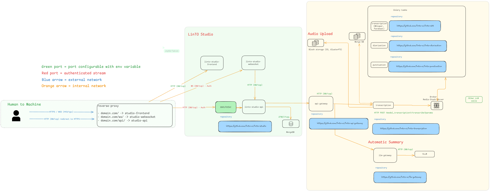

# eMeeting – Developer & Sysadmin Documentation

## Introduction

**eMeeting Overview:** eMeeting is an intelligent meeting management solution built on the Open Source **LinTO Studio** platform [https://github.com/linto-ai](https://github.com/linto-ai). LinTO Studio serves as the backbone of eMeeting, providing a robust web interface and AI-powered services for recording, transcribing, and managing meeting media. eMeeting extends LinTO Studio with **“live plugins”,** a set of tools designed to operate and manage, at scale, transcription sessions from inbound audiovisual streams. Particularly in enterprises or structures managing multiple meeting rooms, whether physical or virtual. A transcription session is essentially a meeting where multiple speakers may speak different languages. that enable real-time functionality, such as live streaming transcription and instant subtitling during meetings. In essence, LinTO Studio handles the core media processing and data management, while the live plugins enhance its capabilities for live sessions and videoconferences.

**Key Features:** With LinTO Studio at its core, eMeeting offers a rich set of features for meeting recording and analysis:

- **Recording & Media Management:** Capture meetings (audio/video) and store them for later processing. LinTO Studio’s web frontend allows users to upload or record sessions and organize media files.
- **Automatic Transcription:** High-accuracy speech-to-text transcription is performed using LinTO’s speech services. This includes support for multiple languages and models (e.g., Open Source Whisper, Kaldi or commercial ASR) and leverages GPU acceleration for fast processing. Transcripts are time-aligned with the original media for easy navigation.
- **Speaker Diarization:** The system can automatically segment and identify speakers in the audio. This helps attribute portions of the transcript to different speakers (i.e., “who said what”) during a meeting. If reference voice samples for known participants are provided, the diarization service can even recognize specific individuals.
- **Punctuation & Formatting:** A punctuation service intelligently inserts punctuation and formats numbers or abbreviations in the raw transcript, producing more readable text. This alleviates the need for manual text correction.
- **Live Subtitling & Streaming Transcription:** eMeeting supports real-time transcription. You can transcribe speech live from various sources – for example, directly from a web browser’s microphone or a videoconference feed. The system can generate live subtitles during meetings or webinars. LinTO’s **Live Plugins** are designed to handle inbound audio/video streams (via protocols like WebSocket, RTMP, or SRT) and feed them into the transcription pipeline. In practice, an AI agent (or “bot”) can join a videoconference and stream the audio to LinTO Studio, which transcribes it on the fly and provides live captions. The live subtitling system connects multiple automatic speech recognition (ASR) providers to enable transcription of multilingual meetings. Its primary objective is to provide users with live closed captions and the ability to download transcripts of past sessions. In other words, the project bridges audio streams, with SRT streams as a first-class citizen, to ASR providers and manages transcripts, including real-time delivery and downloadable artifacts.
- **Collaboration & Editing:** The platform includes collaborative tools for reviewing and editing transcripts. Multiple users can highlight text, correct transcription errors, annotate important parts of the discussion, and collaboratively build the meeting minutes. Edits can be done in real-time through the web interface, which communicates via the Studio’s WebSocket server to sync changes.
- **Summarization:** eMeeting can generate concise summaries of meetings using advanced **Large Language Model (LLM)** techniques. The **LLM Gateway** service integrates with LinTO Studio to produce an automatic meeting summary or extract key points from lengthy transcripts. This helps users quickly digest the content of long meetings.
- **Subtitles and Export:** Users can easily produce subtitles for videos (with proper timing and speaker labels) and export transcripts or subtitles in multiple formats (JSON, text, SRT, etc.). This is useful for sharing meeting records or creating accessible video content.

All these features are enabled by the underlying LinTO Studio architecture and its associated AI services. The live plugins broaden the scope by allowing eMeeting to function not just as an offline transcription tool but as a **real-time meeting assistant**. Next, we will detail the system architecture and how the components interact, followed by deployment instructions for developers and system administrators.

## System Architecture

eMeeting’s architecture is composed of the **LinTO Studio core components** and various **microservices** that provide AI capabilities. All components are containerized for easy deployment, and they communicate over defined APIs and message channels. Below is an overview of the key components:



### Sources :

**linto-studio-frontend**

[https://github.com/linto-ai/linto-studio/tree/master/studio-frontend](https://github.com/linto-ai/linto-studio/tree/master/studio-frontend)

**linto-studio-websocket**

[https://github.com/linto-ai/linto-studio/tree/master/studio-websocket](https://github.com/linto-ai/linto-studio/tree/master/studio-websocket)

**linto-studio-api**

[https://github.com/linto-ai/linto-studio/tree/master/studio-api](https://github.com/linto-ai/linto-studio/tree/master/studio-api)

**API-Gateway**

[https://github.com/linto-ai/linto-api-gateway](https://github.com/linto-ai/linto-api-gateway)

**Transcription Service**

[https://github.com/linto-ai/linto-transcription](https://github.com/linto-ai/linto-transcription)

**LinTO - STT**

Docker builds available: linto-stt-whisper, linto-stt-kaldi

[https://github.com/linto-ai/linto-stt](https://github.com/linto-ai/linto-stt)

**Diarization**

[https://github.com/linto-ai/linto-diarization](https://github.com/linto-ai/linto-diarization)

**Punctuation**

[https://github.com/linto-ai/linto-punctuation](https://github.com/linto-ai/linto-punctuation)

**Automatic Summarization**

[https://github.com/linto-ai/llm-gateway](https://github.com/linto-ai/llm-gateway)

### LinTO Studio Core Components

These core components form the backbone of eMeeting, managing the user interface, application logic, and data storage:

- **Studio Frontend (Web UI):** A web application (built with modern JS frameworks) that users interact with. It provides the main interface for uploading media, viewing live transcriptions, editing transcripts, managing meetings, etc. This frontend is packaged as a Docker container (`linto-studio-frontend`).
- **Studio WebSocket Server:** A real-time communication server (`linto-studio-websocket`) that enables live updates between clients and the backend. For example, as the transcription progresses or as collaborators make edits/annotations, the WebSocket server pushes updates to all connected clients instantly. This ensures that all participants see the same real-time subtitles or transcript edits during a live session.
- **Studio API (Backend):** A RESTful backend service (`linto-studio-api`) that handles business logic and data management for the Studio. This includes managing transcription tasks, orchestrating with other services (transcription, diarization, etc.), handling user authentication, and providing endpoints for the frontend (and external integrations) to query or control the system. The Studio API is also responsible for organizing media and transcript data in the database.
- **Database (MongoDB):** A MongoDB database stores persistent data for LinTO Studio – such as uploaded media files metadata, transcription results, user accounts, organization info, and annotations. MongoDB runs as a container within the deployment and is used by the Studio API to persist and retrieve data.

### Auxiliary Services and AI Engines

LinTO Studio relies on several auxiliary microservices (LinTO AI services) to perform heavy-lifting tasks like speech recognition and natural language processing. These services operate behind the scenes and are invoked by the Studio API or the transcription orchestrator when needed:

- **Transcription Service (Orchestrator):** This is a coordinating service that manages transcription jobs. When a user requests a transcription (either for a recorded file or a live stream), the request goes to the transcription service (often called **`transcription_service`**). This service breaks the task into sub-tasks and routes them to appropriate worker services (STT, diarization, punctuation, etc.). It handles job queueing, parallelization, and sequencing of tasks. For example, it might first send audio to the STT service, then pass the resulting text to punctuation and diarization services, then combine everything. The transcription service ensures tasks are performed in order and retries or error-handles as needed. It exposes an API endpoint so that the Studio backend (or any authorized client) can submit transcription jobs and poll results.
- **Speech-to-Text (STT) Services:** These are the core Automatic Speech Recognition engines. LinTO Studio can use **LinTO-STT** services for converting speech audio into text. Typically, separate STT containers may be deployed for different languages or different ASR model families. For instance, one might run `linto-stt-whisper` (with Whisper models for English, French, etc.) or `linto-stt-kaldi` (for Kaldi models). The deployment can include multiple STT instances (e.g., one for English, one for French) to handle multilingual needs. These services are optimized for GPU usage – if a GPU is available, they will utilize it to speed up transcription. STT services interface with the transcription orchestrator: they receive audio segments and return the recognized text.
- **Speaker Diarization Service:** LinTO’s diarization microservice (`linto-diarization`) segments audio by speaker and can identify speakers given voice samples. During a transcription job, after or in parallel with STT, this service processes the audio to produce speaker turn information (e.g., timestamps for when speaker changes occur, and speaker labels if known). The result is either used to tag the transcript with speaker IDs or to split the transcript by speaker segments. This service can also leverage a GPU for faster processing, as diarization models (especially those doing speaker identification) can be computationally intensive.
- **Punctuation Service:** The punctuation service (`linto-punctuation`) adds punctuation and casing to raw transcripts. ASR outputs are typically just a stream of words without punctuation or proper capitalization. This service takes the initial transcript text and predicts where to insert periods, commas, question marks, and also handles formatting like numbers or acronyms. The result is a more natural, readable transcript. It is usually invoked after the STT has produced text.
- **LLM Gateway (Summarization Service):** For generating summaries or other advanced NLP tasks, eMeeting uses the **LLM Gateway** service. This component interfaces with Large Language Models (like GPT-based models) to produce summaries of transcripts or answer questions about the meeting content. The LLM Gateway breaks down long transcripts and uses a refine method to handle summarization of long documents in sections. It can work with different back-end LLMs (OpenAI-compatible APIs, or local large models through frameworks like VLLM or others). The summarization task is typically triggered on demand (e.g., when a user requests a meeting summary in the UI) and the result is returned to Studio for display and storage.

All these AI services are **containerized** and **decoupled** – communication typically happens via REST APIs (often documented via Swagger, as we will see in the deployment section), and sometimes via message queues for asynchronous tasks. This modular architecture allows scaling specific services as needed (for example, running multiple STT containers for higher throughput).

### API Gateway and Reverse Proxy

To streamline external access and integration, eMeeting’s architecture can include an **API Gateway** service and uses a **Traefik reverse proxy**:

- **LinTO API Gateway:** The API Gateway is an optional but useful component that fronts the various microservice APIs. It can act as a single entry point for all client requests. The gateway can enforce authentication, routing, and apply middleware (for example, logging, rate limiting, billing metrics, etc.) to the API calls. In the context of eMeeting, the Studio frontend and backend can be configured to route all requests through this gateway (usually at a `/gateway/` path), simplifying network configuration and enhancing security. The gateway can proxy requests to the Studio API, Session API, STT services, etc., based on URL paths. This is especially useful in cloud deployments where you might expose only the gateway’s endpoint publicly and keep internal services hidden. (In deployment, using the gateway is often optional – direct access routes are also available as described later.)
- **Traefik Reverse Proxy:** Traefik is used as the web proxy and SSL terminator for the Docker Swarm stack. During deployment, Traefik is configured to automatically route incoming HTTP/HTTPS traffic to the appropriate service based on the URL path (it reads configuration from the generated YAML files and Docker labels). For example, requests to `https://<domain>/cm-api/` might be forwarded to the Studio API container, while `https://<domain>/stt-french-whisper-v3/` goes to the French STT service, and `https://<domain>/gateway/` goes to the API gateway service, etc. Traefik also handles TLS certificates: in **server mode** deployment, it can use Let’s Encrypt to automatically generate and renew certificates for your domain, and in **local mode**, it will use self-signed certificates (via mkcert) for development convenience. Essentially, Traefik is the component that binds everything to ports 80/443 and provides a unified web entry point for all eMeeting services.

### Live Session Plugins (LinTO Live Plugins)

One of the distinguishing aspects of eMeeting is its ability to support live meeting sessions. The **LinTO Live Plugins** are a set of services developed to extend LinTO Studio for live streaming transcription and real-time collaboration. Key elements include:


- **Session API Service:** A dedicated **Session API** is deployed as part of the live plugins. This service allows clients (like the Studio frontend or a mobile app) to create and manage live transcription sessions. A “session” represents a live meeting or stream that is being transcribed in real-time. Through the Session API, users can start a session (possibly specifying language or participants), stop a session, and fetch live transcription data. Under the hood, starting a session will initiate the streaming pipeline (connecting to audio source, feeding STT continuously, etc.). This service also manages the state of live sessions and may coordinate multiple streams (audio, video) if needed. (Its API is documented via Swagger at `/session-api/api-docs/` for easy exploration)
- **Streaming Ingest Plugins:** These include components to ingest live audio/video streams into the LinTO transcription system. The plugins support **WebSocket streaming**, **RTMP (Real-Time Messaging Protocol)** streams, and **SRT (Secure Reliable Transport)** streams. In practice, these are different ways audio can be fed into the system:
    - *WebSocket Plugin:* Allows a browser or any WS client to send raw audio data (for example, from a microphone) directly to the LinTO backend for live transcription. This is used for the “Record & Transcribe from browser” feature.
    - *RTMP Plugin:* Allows integration with systems that output RTMP (commonly used by streaming software). For example, a virtual meeting recorder or a streaming server could push an RTMP audio stream to eMeeting.
    - *SRT Plugin:* Allows using SRT protocol, which is low-latency and secure, for sending live audio.
    Each of these plugins runs as a service listening for incoming streams and then passes the audio data to the STT service in real-time. They ensure the audio is broken into chunks, possibly do some buffering or format conversion, and handle network aspects of the stream.
- **Scheduler/Orchestrator for Live Streams:** The live plugin suite also includes a scheduler (as indicated by the repository structure, e.g., a `Scheduler` component in the plugins repository) that might manage scheduling of transcription tasks for live streams and allocate resources (for example, it might spawn an STT worker for each live session or manage the life cycle of live transcriptions). This ensures that each ongoing meeting session gets transcription service in real-time without interfering with others.
- **Integration with Studio:** The live transcription results produced via the live plugins are fed back into LinTO Studio so that users can see the subtitles in real time on the Studio frontend. The WebSocket server plays a key role here: as transcribed text is produced for a session, it’s broadcast to all participants viewing that session. The Studio API and database also store interim and final transcripts from live sessions, making them available for later search or editing once the session is over (essentially turning a live session into a saved recorded meeting in the system).

**Summary:** In an eMeeting deployment, LinTO Studio (frontend, backend, DB) provides the interface and persistent storage for meetings, while a collection of microservices (STT, diarization, etc.) provide the AI capabilities. The live plugins add real-time streaming support, allowing eMeeting to function as a live conference assistant in addition to an offline transcription tool. All these components are deployed as Docker containers orchestrated by Docker Swarm, with Traefik routing and (optionally) an API Gateway centralizing the APIs. The following sections will guide you through deploying this architecture using the provided LinTO Deployment Tool and explain how to configure and manage the system.

## Deployment Guide (Using the LinTO Deployment Tool)

Link to LinTO Deployment tool and associated documentation :  [GitHub - linto-ai/linto: Start here !](https://github.com/linto-ai/linto#:~:text=The%20LinTO%20Deployment%20Tool%20streamlines,across%20multiple%20nodes%20if%20required)

Deploying eMeeting (LinTO Studio and its services) is facilitated by an official **LinTO Deployment Tool**. This tool is essentially a set of Bash scripts plus configuration templates that automate the setup of all required services. It greatly simplifies the installation for developers and system administrators by handling Docker Swarm initialization, network setup, configuration generation, and service launch. The deployment tool will generate all the necessary **YAML configuration files** for the Docker Swarm stack, tailored to your choices (which services to include, what configuration values to use). In other words, you do **not** have to manually write Docker Compose or Swarm configs for each service – the tool’s Bash scripts will interactively collect your input and produce the config for you.

Below we provide a step-by-step guide to deploying eMeeting using this tool, along with explanations for each step and the underlying processes. This guide assumes a Linux environment for the server (though Windows with WSL2 is also supported with some additional setup).

This Docker Swarm / Docker compose deployment is a base that you might adapt to your actual needs (i.e : Kubernetes deployment)

### Prerequisites

Before running the deployment, ensure the following prerequisites are met:

- **Operating Environment:** A modern 64-bit operating system (Linux is recommended for servers). Windows 10/11 users can deploy via **WSL2** (Windows Subsystem for Linux) with Docker Desktop. MacOS users can also use Docker Desktop.
- **Docker:** Install Docker Engine on the host machine. The deployment uses Docker in **Swarm mode**, but you do not need to manually init Swarm – the setup script will do it if not already done. Just make sure Docker is installed and running. (On Windows, Docker Desktop with WSL2 integration is required; on Linux, the standard Docker CE works.)
- **Network and Access:** If deploying in a server environment, ensure you have a domain name ready (for HTTPS via Let’s Encrypt) and that ports 80 and 443 are open for web traffic. If you’re testing locally (local mode), you can use `localhost` with self-signed certificates.
- **Internet Access:** The deployment will pull Docker images for various services from Docker Hub or other registries. Ensure the host machine can access the internet to download these images on first run.

## Infrastructure Requirements

The infrastructure requirements vary based on the services you intend to deploy. Here are some general guidelines:

- **CPU Deployment**: Suitable for development or low-demand scenarios, such as testing or small-scale deployments, which can be run on a typical local machine or a small cloud instance.
- **GPU Deployment**: Recommended for Whisper models or real-time transcription, as these services are computationally intensive. For production-level deployment involving real-time transcriptions, a machine with a compatible Nvidia GPU is highly advised.

### Resource Specifications by Service

| **Service** | **Scope** | **CPU** | **Max Replicas** | **Target Replicas** | **Memory Recommended** | **Disk Space (Container)** | **Justification** |
| --- | --- | --- | --- | --- | --- | --- | --- |
| **session-api** | Session transcription management API | 1 CPU | 1 | 1 | 1 GB | 5 GB | API resource allocation. |
| **session-broker** | Data exchange bus for session transcription | 2 CPU | Depends on tech | 1 | 4 GB | 5 GB | Uses broker tech like Mosquitto or RabbitMQ, disk space dependent on logs. |
| **session-postgres** | Database for session transcription | 1 CPU | 1 | 1 | 1 - 2 GB | 5 GB | PostgreSQL requires sufficient storage for application logs and indexes. |
| **session-scheduler** | Orchestrator for session transcription | 1 CPU | 1 (Mandatory) | 1 | 1 GB | 5 GB | Lightweight service but requires space for logs. |
| **session-transcriber** | Transcoding server / relay for session transcription | 16 CPU per instance | N | 1 | 16 - 24 GB | 5 GB | Handles streaming audio, high storage needs for generated files. |
| **llm_gateway** | Summary API service | 1 CPU | 1 | 1 | 1 GB | 5 GB | Requires space for libraries. |
| **vllm-service** | LLM processing unit (Worker) | 8 CPU (GPU Required) | N | 1 | 16 GB VRAM | 10 GB | Requires GPU access. |
| **api_gateway** | API discovery service for Whisper transcription | 1 CPU | 1 | 1 | 1 GB | 5 GB | Similar needs as llm_gateway. |
| **stt-all-whisper-v3** | Whisper transcription service (files) | 8 CPU (min) | 1 per worker set | 1 | 8 GB | 5 GB | Sequential processing model. |
| **stt-all-whisper-v3_workers** | Whisper transcription worker unit | 2 - 4 CPU (GPU Required) | N | N | 8 GB per worker | 5 GB | Faster transcription processing with GPU acceleration. |
| **stt-diarization-pyannote** | Whisper diarization worker unit | 8 CPU (GPU Required) | N | N | 16 - 32 GB | 5 GB | Each new instance halves diarization time. |
| **stt-mongo** | Whisper transcription database (files) | 1 CPU | 1 | 1 | 1 - 2 GB | 5 GB | External storage sufficient for caching and logs. |
| **task-broker-redis** | Exchange bus between transcription & workers | 1 CPU | 1 | 1 | 2 GB | 5 GB | Redis task queue, disk space for libraries and logs. |
| **studio-api** | Backend web service | 1 CPU | N | 1 | 2 GB | 10 - 15 GB | Backend service needs for handling logs, uploads, and libraries. |
| **studio-mongodb** | Web service database | 2 CPU | 1 | 1 | 2 GB | 5 GB | Data is stored within a database. |
| **studio-frontend** | Web frontend service | 1 CPU | N (Easily scalable) | 1 | 512 MB | 3 GB | Static service, 5 GB covers system and configuration files. |
| **studio-websocket** | WebSocket connection handler | 1 CPU | 1 | 1 | 2 GB | 5 - 10 GB | Space requirement depends on daily log volume. |

This table summarizes the resource allocations per service, including CPU, memory, disk space, and scaling considerations.

### Environment Configuration

The deployment tool uses an environment file to customize the installation. After obtaining the deployment tool (by cloning the repository), you should prepare this file:

1. **Get the Deployment Tool:** Clone the LinTO deployment repository (the `linto` repository on GitHub) onto your machine and enter the directory. For example:
    
    ```bash
    git clone <https://github.com/linto-ai/linto.git> -b next
    cd linto
    
    ```
    
    (Use the `next` branch as provided, or omit `-b next` to use the default branch which contains the latest stable deployment scripts.)
    
2. **Configure `.env` Variables:** The repository provides a template file named **`.envdefault`** which contains default settings. Copy this to a new file named `.env`:
    
    ```bash
    cp .envdefault .env
    
    ```
    
    Then open `.env` in an editor and modify values as needed for your environment. This step is crucial – it defines deployment parameters such as network names, credentials, and feature toggles. Key variables include:
    
    - **DOCKER_NETWORK:** The Docker network name for the stack (default `linto`). You can usually keep the default unless it conflicts with an existing network.
    - **LINTO_STACK_NAME:** The name of the Docker Swarm stack (default `linto`). This will be the stack identifier when you run the services.
    - **LINTO_HTTP_USER** and **LINTO_HTTP_PASSWORD:** These set basic HTTP authentication for certain web interfaces. For example, access to monitoring dashboards or Swagger UIs might be protected. The default user is “linto” with password “LINAGORA” , but **you should change the password** to something secure for production.
    - **LINTO_IMAGE_TAG:** Specifies which Docker image tag to use for LinTO services (e.g., `latest` or `latest-unstable`). By default it might be set to an unstable or development tag ; you may set it to a specific version or `latest` for stable releases as needed.
    - **LINTO_SHARED_MOUNT** and **LINTO_LOCAL_MOUNT:** Paths on the host for storing data. The *shared mount* is used by services to store persistent data (such as uploaded media, intermediate files, etc.), and *local mount* might store configuration or runtime files (like the generated YAMLs). Defaults might be `~/shared_mount` and `~/deployment_config`. Ensure these paths have sufficient space and set them to locations that persist data as needed.
    - **REDIS_PASSWORD:** A password for Redis (if the deployment uses Redis for caching or message brokering). A default is provided, but you should change it for security.
    - **LINTO_FRONT_THEME:** The UI theme for the LinTO Studio frontend. This can typically be left as default (e.g., a color scheme like "LinTO-green"), but it’s an option to brand the interface.
    - **ORGANIZATION_DEFAULT_PERMISSIONS:** The default feature permissions granted to new organizations in LinTO Studio. By default, it might be `upload,summary,session` – meaning any new organization (team/tenant in the system) can upload media, use summarization, and use session (live meetings) features. If you want to restrict any of these by default or disable some features platform-wide, you can adjust this (for instance, remove `summary` if you don’t want LLM summarization available to users initially, or set to `none` to require manual enabling of features per organization).
    - **SUPER_ADMIN_EMAIL** and **SUPER_ADMIN_PWD:** Credentials for a super administrator account. The superadmin is a user with full control over the system (across organizations). This account can be used to access the **Studio back office** to manage organizations, users, and global settings. It is highly recommended to set a real email and strong password here before deployment. The superadmin account will be created on first startup using these values. (If you use the defaults, be aware that everyone who knows the software might know the default admin login – so definitely change in production).
    
    In summary, the `.env` file allows customization of network names, domain settings, authentication, storage paths, enabled features, etc., without modifying the code or scripts. Adjust these values according to your needs before proceeding. If you do not create a `.env`, the `setup.sh` will fall back to `.envdefault` values.
    

### Running the Setup Script (`setup.sh`)

Now you are ready to run the interactive setup. Execute the `setup.sh` script to initiate the environment preparation:

```bash
./setup.sh
```

Running this script will kick off an interactive configuration process in your terminal. You will be prompted with a series of questions and guided through the setup. The script performs several important tasks automatically, as summarized below:

- **Cleanup of Previous Configurations:** On start, the script will remove any existing service configuration files (`.yaml` files) in the `running/` directory. This ensures a clean slate. (If you ran the tool before and generated configs, they are wiped so that outdated configs don’t linger). Essentially, it resets the deployment configuration each time, so you can reconfigure safely.
- **Dependency Installation:** The script checks for and installs all necessary software dependencies on the host that are required for the deployment process. This includes:
    - `dialog` – for presenting the interactive text dialog interface in the terminal (the UI for the prompts).
    - `jsonnet` – a tool used for generating configuration files. LinTO uses Jsonnet templates for service definitions, which get compiled to YAML.
    - `yq` and `jq` – command-line YAML/JSON processors used to manipulate config files.
    - `apache2-utils` – provides the `htpasswd` utility, used here to set up HTTP Basic Auth credentials (for securing certain web endpoints).
    - `mkcert` – a utility to generate self-signed SSL certificates easily. This is used for **local mode** deployments to create a local Certificate Authority and certs for `localhost`. (In server mode, Let’s Encrypt is used instead.)
    These dependencies are installed automatically (likely via apt on Debian/Ubuntu) if they are not already present. The user may be prompted for sudo password to install packages. All required tools are installed to ensure the environment is ready for the next steps.
- **Network and Directory Setup:** The script will create the Docker networks and local directories needed by the services. For example, it will create a Docker overlay network named as per `DOCKER_NETWORK` (default `linto`) for the stack’s internal communication. It also prepares directories on the host file system for volumes: e.g., a directory for STT model data, one for LLM data, one for MongoDB data, one for Traefik configuration, etc. These correspond to the `LINTO_SHARED_MOUNT` and others you configured – ensuring that when containers start, they have the necessary volume mount points. This step is done early so that subsequent service configuration can reference these paths.
- **Deployment Mode (Server vs Local):** You will be prompted to choose a mode: **“server”** or **“local”**. This setting primarily affects how SSL certificates are handled:
    - *Server mode:* Choose this if you are deploying on a server with a public domain. The script will request a domain name (and possibly email for Let’s Encrypt) and automatically obtain a Let’s Encrypt TLS certificate for that domain. This provides a valid HTTPS setup trusted by browsers. The process is automated via Traefik’s integration with Let’s Encrypt (using HTTP-01 challenge on port 80, so ensure your domain’s DNS points to this server and port 80/443 are open).
    - *Local mode:* Choose this for a development or testing environment (e.g., on `localhost` or an IP without a real domain). The script will utilize `mkcert` to generate a self-signed certificate for you. It creates a local CA and certificate so that services can run on HTTPS locally. Note that browsers will treat this as self-signed (unless you import the mkcert CA into your trust store), so you’ll need to bypass security warnings (more on that later). This mode avoids needing any external network calls or domain setup.
    This prompt is important for ensuring you have a working HTTPS reverse proxy. Make the appropriate choice based on your deployment scenario.
- **Service Selection:** Next, the setup wizard will allow you to select which services/components you want to deploy. This is presented as a checklist (if using the dialog UI) where you can choose among options like:
    - **Transcription (STT) services** – often you’ll see options for languages or models (e.g., “French Whisper”, “English Whisper”, etc., possibly also Kaldi models). Select the ASR engines you need. At least one STT service should be selected for transcription to function.
    - **Diarization service** – to include speaker diarization.
    - **Punctuation service** – to include automatic punctuation.
    - **Summarization (LLM Gateway)** – to include the LLM-based summarization service.
    - **Live Streaming (Live Plugins)** – to include the live transcription plugins (Session API, streaming ingest). This might be labeled as “Session service” or “Live transcription.” Enable this if you want eMeeting’s real-time meeting transcription features.
    - **LinTO Studio** – the core platform (frontend, websocket, API, DB). This is typically selected by default, as it’s the primary interface. (The tool allows you to deploy components piecemeal, but for eMeeting you’ll usually deploy the full stack.)
    You should select all components that are relevant to your use case. For a full eMeeting setup, you’d include Studio and all the AI services (transcription, STT, diarization, punctuation, summarizer, session). If you have limited resources or specific focus, you may exclude some (for example, you might skip summarization if you don’t plan to use it). The script will only generate configs for the services you select.
- **GPU Acceleration Prompt:** If the setup detects a GPU or in any case, it will ask if you want to enable **GPU support** for the services. Answer “Yes” if your host has an NVIDIA GPU with proper drivers – this will configure the services to use GPU (for instance, the STT containers will be deployed with NVIDIA runtime). If you answer “No” or have no GPU, the services will run in CPU mode. (GPU mode is recommended for Whisper or any heavy models for production use. Note that enabling GPU requires additional host setup (see **GPU Support** below) – ensure you have done that, otherwise the containers might fail to access the GPU.
- **Swarm Initialization:** The script will ensure Docker is in **Swarm mode**. If you haven’t run `docker swarm init` before, it will do so automatically. If you are running a single-node deployment, this will initialize a new swarm with the current node as manager. In multi-node scenarios, you should join worker nodes to the swarm manually (the tool doesn’t prompt for that, it assumes you either have a swarm or are okay with single node). If your current Docker user is not a swarm manager, the script may attempt to promote it (especially if it needs to create networks). Essentially, this step sets up the orchestration layer for the stack deployment.
- **Configuration Generation:** Finally, based on all the selections and inputs, the `setup.sh` will **generate a set of YAML configuration files** for Docker Swarm. These files define each service (as a Docker stack service) with the appropriate settings. The generation is done using *Jsonnet templates* and the parameters you provided:
    - For example, if you selected “STT English Whisper”, the tool will generate a YAML (or add to a combined YAML) with the service definition for the English STT container (image name, environment variables, volumes, etc.). If you chose server mode with a domain, the Traefik labels in these YAML files will reflect your domain, and Let’s Encrypt configuration. If local, the YAML will reference the self-signed certificate files generated by mkcert.
    - The generated YAML files are placed in the `./running/` directory of the repository. Each major component might have its own YAML (e.g., `running/studio.yml`, `running/stt-french.yml`, etc.), or it might consolidate some. The exact breakdown can be checked in the `running` directory after generation.
    - These files are what Docker will use to actually create the containers and networks. The reason this step exists is to allow review or customization if needed – you could inspect the YAMLs to see how services are configured, or tweak something manually if you have advanced needs (though that’s rarely necessary). The use of templates ensures consistency and correct configuration (for instance, it sets up the inter-service connections, environment variables linking to the right hostnames for each service, etc.).

Once the `setup.sh` completes, your environment is prepared: Docker Swarm is configured, necessary certs and networks are in place, and you have a set of tailored YAML files for the next step. The tool will output messages indicating success of each section and may remind you what to do next.

> Note: The setup script is non-destructive to other Docker workloads on your machine. It creates new networks and uses the stack name you set, so it should not interfere with existing Docker containers or compose projects running on the same host (GitHub - linto-ai/linto: Start here !). It also does not stop any running containers outside of the LinTO stack. You can therefore run it on a host that’s also used for other services, though caution and resource planning are advised.
> 

### Running the Start Script (`start.sh`)

After the setup phase, you are ready to launch the eMeeting services. The `start.sh` script will deploy the stack using the Docker Swarm configs that were generated:

```bash
./start.sh
```

This script is much simpler – it essentially performs a `docker stack deploy` (or equivalent) for the stack, using the `.yaml` files in the `running/` directory ([GitHub - linto-ai/linto: Start here !](https://github.com/linto-ai/linto#:~:text=To%20launch%20the%20LinTO%20services%2C,run)). When you run `start.sh`, it will:

- Read all the YAML files in `./running` that were created by setup.
- Deploy them as a unified stack in Docker Swarm (with the stack name `$LINTO_STACK_NAME` from your env, e.g., “linto”). This creates all the containers/services and connects them to the `linto` network. Docker will pull the necessary images if they aren’t already downloaded.
- The script will output the progress of stack deployment. You can monitor it via Docker commands or the provided monitoring tools (see below).

At this point, Docker Swarm will initiate each container. The order and orchestration are managed by swarm (the YAML will have dependencies defined where necessary). Typically, within a couple of minutes, all services should be up and running (time depends on image download speeds and whether models need to be downloaded inside containers, etc.).

You can check the status of the services using:

```bash
docker stack ps linto   # replace 'linto' with your stack name
```

This will list all services in the stack and their current state (Running, Starting, etc.). If any service fails to start (e.g., due to missing GPU or port conflict), it will show here. You can also use `docker service ls` and `docker service logs` for debugging if needed.

Once the stack is running, the eMeeting platform is live and you can begin accessing the web interface and APIs. The next section details how to access the various components and what URLs to use.

### Post-Deployment Access and Verification

With the stack deployed, you should verify that each component is accessible. Below are the common endpoints and interfaces you will use. (In the examples, we use `localhost` assuming a local deployment. If you used a custom domain in server mode, replace `localhost` with your domain name in all URLs. Likewise, if you changed default paths, use those.)

**Web Interfaces:**

These are services accessible through a web browser, providing UI or monitoring dashboards:

- **LinTO Studio Frontend:** This is the main user interface of eMeeting. It should be accessible via **`https://localhost/`** (if you configured root path). Open a browser and navigate to your domain (or `localhost`) – the LinTO Studio web app will load. Here you can log in (using the superadmin credentials or any user you create) and start using the application (upload media, start a session, etc.). If you get a certificate warning (self-signed in local mode), you’ll need to accept the risk/exception in the browser to proceed (since the certificate isn’t from a public CA).
- **Swarmpit (Monitoring UI):** A monitoring dashboard for Docker Swarm is included for convenience. It’s accessible at **`https://localhost/monitoring-swarmpit/`**. Swarmpit allows you to visualize the swarm nodes and services, view container logs, resource usage, and manage the stack (restart services, scale, etc.) through a nice web UI. This might be protected by basic auth (use the LINTO_HTTP_USER/PASSWORD you set). It’s very useful to check that all services are healthy and to troubleshoot if something isn’t working (e.g., see if a container is restarting repeatedly).
- **Celery Flower (Task Monitor):** Celery is used by some LinTO services for background tasks (for example, splitting audio, executing asynchronous jobs for transcription, etc.). A Celery Flower service is provided to monitor these tasks. Access it at **`https://localhost/monitoring-celery/`**. It will show a dashboard of tasks queued, running, succeeded, or failed. This is more of a debugging tool for developers, to ensure background processes are working as expected. It may also be behind basic auth.

When you access these interfaces for the first time:

- For **Studio**: Log in with your superadmin account (email/password as set in `.env`). Then you can create organizations, invite users, or if it’s just you, use the default organization that might be auto-created. Explore settings in the back office section (accessible to superadmin) to configure any email (SMTP) settings, etc., as needed.
- For **Swarmpit/Celery**: use the HTTP basic auth. If you kept defaults, user “linto” and password “LINAGORA” (but if on a server, those defaults should have been changed for security).

**API Documentation (Swagger UI):**

Many of the microservices include built-in Swagger UI pages that document their REST API endpoints. This is extremely useful for developers who want to integrate or test the APIs directly. The following Swagger UIs are available (navigate to these in your browser after deployment):

- **Studio API (Core backend API):** `https://localhost/cm-api/apidoc/#/`  – This shows documentation for the main LinTO Studio backend API (often referred to as `cm-api` or content management API). It includes endpoints for managing media, transcripts, organizations, users, etc. You can try out calls from here (note: authentication may be required for some endpoints; likely via JWT or basic auth – see the LinTO auth documentation for how to authorize requests).
- **Session API (Live sessions API):** `https://localhost/session-api/api-docs/#/` – Documentation for the Session API, which handles live meeting sessions (starting sessions, stopping, getting live transcript updates if applicable, etc.). If you deployed the live plugins, this will be available. It’s useful to see how to programmatically control live transcriptions or integrate an external audio source.
- **STT Service APIs:** If you deployed STT services, each one will have its own Swagger: e.g.,
    - `https://localhost/stt-french-whisper-v3/docs/#/` for French Whisper model API,
    - `https://localhost/stt-english-whisper-v3/docs/#/` for English Whisper , etc.
    These APIs allow you to send audio and get transcription results. Usually, you won’t call them directly (the transcription orchestrator calls them), but the docs are there in case you want to test the STT in isolation or understand its interface.
- **LLM Gateway API:** `https://localhost/llm-gateway/docs/#/` – Documentation for the summarization (LLM Gateway) API. This allows you to see how to request a summary. For example, it might have an endpoint where you provide a transcript or media ID and it returns a summary text.

Each of these Swagger UIs provides an interactive way to send requests to the respective service. If you have authentication on the gateway or services, you might need to provide an auth token in the Swagger UI (there’s usually an authorize button). By default, if you kept basic auth, you may need to enter those credentials. Or if the Studio uses JWT tokens for API, you’d obtain one by logging in via the auth endpoint. This is more advanced usage; for now, just verify you can reach these pages.

**Direct API Endpoints:**

In addition to the Swagger UI, it’s important to know the base endpoints for actual API calls (especially if integrating with other applications or writing scripts). The Traefik proxy exposes each service on a specific path, as configured in the YAML labels. By default, the base URLs are:

- **Studio API:** `https://localhost/cm-api/` – This is the base URL to which the Studio frontend talks for its backend needs. All core functionalities (uploading a file, retrieving a transcript, etc.) are under this.
- **Session API:** `https://localhost/session-api/` – Base URL for live session control.
- **STT APIs:** e.g., `https://localhost/stt-french-whisper-v3/` and `.../stt-english-whisper-v3/` for the STT services. Posting audio to these endpoints (usually a specific route like `/transcribe`) would invoke speech recognition.
- **LLM Gateway:** `https://localhost/llm-gateway/` – base URL for summarization requests.

These direct paths are available **via Traefik** (which routes to the respective service’s internal port). If the API Gateway service is deployed and you prefer to funnel through it, there is also a gateway prefix for each:

- **Through Gateway:** `https://localhost/gateway/cm-api/`, `https://localhost/gateway/session-api/`, etc., are the equivalents if you want to access via the LinTO API Gateway. The gateway might enforce auth or combine multiple services under one domain. In many cases, the direct Traefik routes and the gateway routes achieve the same result; which one is active can depend on your deployment choices (you might deploy gateway and configure Studio to use it, or not).

For initial testing, you can use direct routes. Ensure that if basic auth is enabled, you include the credentials. For example, using `curl` to test an endpoint might look like:

```bash
curl -k -u linto:LINAGORA <https://localhost/cm-api/health>
```

(`-k` is used here to ignore self-signed certs in local mode; `-u user:pass` for basic auth). This should return a health status or similar if the service is up. The docs in Swagger will indicate the exact endpoints for each function.

**Certificate Considerations:**

If you deployed in **local mode** with self-signed certs, your browser will warn “Your connection is not private” when accessing `https://localhost`. You should manually trust or proceed with the self-signed certificate. You can install the mkcert local CA to avoid warnings (mkcert would have generated a CA file; instructions for mkcert can guide importing it into your browser trust store). For quick access, you can usually click “Advanced -> Proceed to localhost” in the browser. Similarly, tools like `curl` will refuse the connection by default due to untrusted cert; use the `-k` or `--insecure` flag to bypass verification. This is fine for local testing. *In server mode with Let’s Encrypt, you should have a valid cert and won’t face these issues.* If using `curl` in production, do not use `-k`; instead ensure proper CA trust (but in production you’d have a valid cert anyway).

At this stage, with the web UI working and APIs reachable, your eMeeting deployment is successful. You can now use the system, or proceed to integrate it with other software via its APIs.

### GPU Support Configuration (Optional)

If you opted to use GPU acceleration (and your host has a suitable NVIDIA GPU), some additional setup is required on the host for Docker to utilize the GPU within containers:

1. **NVIDIA Drivers & CUDA:** Install the appropriate NVIDIA drivers on the host OS, along with CUDA (if not bundled). The driver version must be compatible with the CUDA version expected by the Docker images. For instance, if using NVIDIA Docker images that rely on CUDA 11, ensure the host has CUDA 11 and matching drivers installed. Consult NVIDIA’s documentation for driver installation on your OS.
2. **NVIDIA Container Toolkit:** Install the NVIDIA Container Toolkit (previously nvidia-docker2) on the host. This is essential to allow Docker to interface with the GPU. Once installed, it provides the `nvidia-container-runtime`. Instructions can be found on NVIDIA’s GitHub (it’s typically a package you add and configure).
3. **Docker Daemon Configuration:** Docker needs to be configured to use the NVIDIA runtime by default (especially since Docker Swarm doesn’t allow specifying `-gpus` in the stack YAML as a simple flag). To do this, update or create the Docker daemon config file at `/etc/docker/daemon.json` with the following content:
    
    ```json
    {
        "runtimes": {
            "nvidia": {
                "path": "nvidia-container-runtime",
                "runtimeArgs": []
            }
        },
        "default-runtime": "nvidia"
    }
    
    ```
    
    You can insert this by editing the file or using a one-liner:
    
    ```bash
    sudo tee /etc/docker/daemon.json > /dev/null <<'EOF'
    {
      "runtimes": {
        "nvidia": {
          "path": "nvidia-container-runtime",
          "runtimeArgs": []
        }
      },
      "default-runtime": "nvidia"
    }
    EOF
    
    ```
    
    After adding this, restart the Docker service (`sudo systemctl restart docker` on Linux). This configuration tells Docker to use the NVIDIA runtime for all containers by default, which means any container that can use the GPU will have access to it (provided the image has the necessary CUDA libraries). This is crucial for Docker Swarm deployments to use GPUs, because otherwise Swarm wouldn’t attach the GPU.
    
4. **WSL2 Note (Windows):** If you are running via Docker Desktop on Windows with WSL2, enabling GPU support is a bit different. You must ensure that:
    - In Docker Desktop settings, **Enable GPU support** is turned on (Docker Desktop integrates with WSL to allow GPU, but you need Windows 11 with WSL2 and latest GPU drivers for WSL).
    - The Docker Engine JSON (accessible through Docker Desktop settings -> Docker Engine) is updated similar to above to set the default runtime to `"nvidia"`. For example, the config might look like:
    (It may have other fields like builder and experimental by default; just ensure the runtimes and default-runtime sections are added.) After saving that, Docker Desktop will restart the daemon.
        
        ```json
        {
          "builder": {
            "gc": { "defaultKeepStorage": "20GB", "enabled": true }
          },
          "experimental": false,
          "runtimes": {
            "nvidia": {
              "path": "nvidia-container-runtime",
              "runtimeArgs": []
            }
          },
          "default-runtime": "nvidia"
        }
        
        ```
        
    - Additionally, make sure you have installed NVIDIA’s CUDA toolkit inside WSL or have the appropriate drivers on Windows. Microsoft and NVIDIA provide guidelines for using GPU in WSL2.
5. **Deploy with GPU:** Once the host is configured, and if during `setup.sh` you selected to use GPU, the generated service configurations will include the necessary flags to use the GPU. Typically, the containers will be labeled to use `runtime: nvidia` or similar (the deployment tool handles that for you). On startup, you can verify GPU usage by checking if the container sees the GPU. For example:
    
    ```bash
    docker logs <stt_service_container>
    
    ```
    
    might show it initializing CUDA or list GPUs. Also, inside the container, `nvidia-smi` command would show the GPU if everything is set up (you can exec into a running STT container to test this).
    

By following these steps, your eMeeting deployment will leverage GPU hardware for intensive tasks, which is strongly recommended for production environments that involve real-time transcription or large volumes of data. If GPU is not available, the system will run entirely on CPU – it will work, but expect significantly slower transcription for large files or increased latency for live transcription.

### Managing and Scaling the Deployment

The LinTO/eMeeting deployment is orchestrated by Docker Swarm, which means you can manage it using standard swarm commands or the Swarmpit UI.

- **Scaling Services:** If you need to scale out a particular service (say, run two instances of the English STT to handle more concurrent jobs), you can use `docker service scale linto_stt-english-whisper-v3=2` (replace with actual service name as per `docker service ls`). Swarm will deploy another instance (possibly on the same node or on another node if you have a multi-node cluster). The Transcription orchestrator and Traefik will automatically work with multiple instances (Traefik load-balances requests, and orchestrator will distribute jobs). Note that scaling is mainly useful for stateless worker services like STT or diarization. Do not scale stateful services like MongoDB with this method (Mongo would need a replica set setup which is not in scope of this tool).
- **Multi-Node Swarm:** By default, the tool sets up a single-node swarm. If you want to add more nodes (for load distribution or high availability), you can join additional Docker nodes to the swarm. One approach:
    - On the manager node (existing one), run `docker swarm join-token worker` to get a join command, and run that on other machines to have them join as workers. Ensure network connectivity and that they meet prerequisites (Docker installed, etc.).
    - Once joined, you might need to label nodes or constrain certain services to certain nodes (for example, GPU node vs non-GPU node if only one has GPU). The default YAML might already place GPU services on nodes with GPUs (using node labels or generic resource constraints if any). Check the `deploy` section of generated YAMLs for such constraints.
    - The stack can then be spread across nodes. For instance, one node might run the database and API, another runs STT. Swarm handles service placement.
    - Keep in mind shared storage: the `LINTO_SHARED_MOUNT` path needs to be accessible on all nodes (or at least, services writing to it should be constrained to the node that has it). If you run multi-node, a best practice is to use a network file system or ensure any volume that needs to be common is available on all nodes (the current tool likely assumes a single node for simplicity). Adjust accordingly if distributing components (for example, you might decide to keep MongoDB on one node and ensure all services that need to access its volume run on that node).
    - Multi-node setup is advanced; for most cases, a powerful single node with GPU can handle transcription of one stream at a time or many small tasks. But the architecture allows horizontal scaling when needed.
- **Updating/Stopping Services:**
    - To stop the stack, you can run `docker stack rm linto` which will remove all containers of the stack (this will stop the services but not delete persistent data on disk). You can also individually stop services via Docker, but using stack commands is simpler.
    - To update (e.g., new image versions or config changes), the easiest method is to edit the `.env` or update the repository (if a new version of deployment tool is pulled) and re-run `./setup.sh` and then `./start.sh` again. The tool is designed to regenerate configs and apply changes. Keep in mind this might recreate containers (so plan downtime accordingly). For minor tweaks (like changing a password), sometimes you can directly scale down/up or update a service via `docker service update`. However, using the provided tool ensures consistency (just remember to backup any custom changes you made to YAML or .env).
- **Backups:** For a production system, ensure you have backups of important data:
    - MongoDB data (the volume at `LINTO_SHARED_MOUNT/mongo` or similar) – this contains all transcripts and user data. Regular dumps or volume backups are prudent.
    - Any uploaded media stored in volumes.
    - It’s also good to backup the `.env` file and any configuration so you can redeploy in case of disaster.

### Administration and User Management in LinTO Studio

Once eMeeting is deployed, as a sysadmin or developer configuring the system, you should be aware of the built-in multi-tenant structure and permission model in LinTO Studio (the core of eMeeting):

- **Organizations:** LinTO Studio is organized into **organizations** (which can represent teams, companies, or departments). Each organization is isolated in terms of its data (media and transcripts). Users belong to one or more organizations. By default, an initial organization may be created (e.g., “Default Org”) on first run. The superadmin can create additional organizations through the back office interface. This is useful if you plan to offer the service to multiple groups or just to compartmentalize data.
- **Super Administrator:** The **superadmin** (configured via `SUPER_ADMIN_EMAIL/PWD` in the env) is a global administrator with access to the **Studio back office** ([GitHub - linto-ai/linto: Start here !](https://github.com/linto-ai/linto#:~:text=Creating%20a%20Superuser%20for%20Back,Office%20Access)). The back office is accessible through the Studio UI (usually a specific URL or a section in the UI after login; e.g., perhaps at `https://localhost/backoffice` or via the profile menu). The superadmin can perform actions like:
    - Creating or deleting organizations.
    - Managing global default permissions (as mentioned with `ORGANIZATION_DEFAULT_PERMISSIONS` env).
    - Viewing all sessions across organizations.
    - Managing system-wide settings (like enabling/disabling features globally).
    Essentially, this account oversees the entire eMeeting installation. Make sure to keep the credentials safe. If you didn’t set the env, the default was a known value (which is a security risk), so consider updating it and recreating the superadmin (or change password via database if needed).
- **Default Organization Permissions:** As noted earlier, new organizations by default get certain permissions:
    - *Upload:* allows users in that org to upload audio/video and request transcriptions (i.e., use the transcription service for recorded files).
    - *Summary:* allows them to generate summaries via the LLM gateway.
    - *Session:* allows them to create live transcription sessions (i.e., use the Session API and live plugins).
    These were set by the env variable at startup. The superadmin in back office can override these defaults for each organization or globally. If an organization does not have a permission, that feature will be hidden or not usable for its members. For example, if “session” is not granted, users in that org will not see the option to start live meetings. Adjust these as needed if you want to restrict certain capabilities.
- **User Roles:** Within each organization, there is a role-based access control system defining what each user can do. The roles are hierarchical:
    - **Member:** Basic role, can view and edit media that they have access to (if they are given access to specific media or if media is org-wide). Essentially can participate in using the transcripts.
    - **Uploader:** Can do everything a Member can, plus they can create new media (upload files or record new meetings). This role is needed for someone to initiate transcriptions or add content.
    - **Meeting Manager:** In addition to upload, they can initiate and manage live sessions (meetings). This corresponds to using the Session API – starting/stopping live transcription sessions for an organization. They likely can also manage things like inviting the “LinTO agent” into meetings (if that requires a request from the system side).
    - **Maintainer:** Can manage all users within the organization (invite or remove users, assign roles). This is like an org admin for user management but not full power over content.
    - **Admin (of Organization):** Full control within that organization – can do all of the above plus manage settings for the org (like which features are enabled for that org, etc.). They cannot affect other organizations or system-wide settings (only the superadmin can do that), but they are the top-level authority inside their org.
    Each new user you add to an organization can be assigned one of these roles. By default, when users sign up or are invited, they might become Members unless specified otherwise. The superadmin or an organization Admin can promote users to higher roles as needed. This structure ensures a clear separation of duties and capabilities. For example, not everyone should start a live session or invite external participants, so maybe only “Meeting Managers” do that.
- **Platform roles** : System-wide platform role can get granted to users. These roles includes :
    
    
    
    - Organisation initiator : Can create new organizations
    - Session operator : Can manage sessions (create / start / stop / edit..) across multiple organizations (access to media library is granted by subsequent organization specific roles - like “member”)
    - System administrator : Can manage rights for organization, user roles within organizations.
    - Super administrator : Can manage platform roles for other users and self
- **SSO** : The LinTO Studio platform supports OIDC authentication for user creation. EU Login is supported by the platform.

Appropriately elevated user (platform role) can access the BackOffice and manage organizations, users and permissions.


As a sysadmin, it’s important to set up at least one organization (if not already existing) and assign roles appropriately. For testing, you can simply use the default organization and the superadmin (who has all org admin rights by virtue of being superadmin). But in a production scenario, you would create an organization for say “MyCompany”, then create a normal user account for someone and make them an Admin of that org so they can self-manage their team. The superadmin would then step back and only intervene if needed.

**SMTP & Email:** If you plan to use features like email verification, password reset, or sharing transcripts via email, you should configure an SMTP server. In the LinTO Studio README, there are environment variables for SMTP (host, port, user, pass, etc.). Make sure to set those either in the `.env` or via back office settings so that the application can send emails. This is not strictly required for core functionality but is needed for a polished user management experience (account invites, notifications). The snippet from the README suggests how to set it: e.g., `SMTP_HOST`, `SMTP_PORT`, etc. (Ensure the container running Studio API can reach the SMTP server).

By understanding the above, developers can integrate with eMeeting’s APIs securely, and system administrators can manage users and permissions effectively, aligning the tool with their organization’s policies.