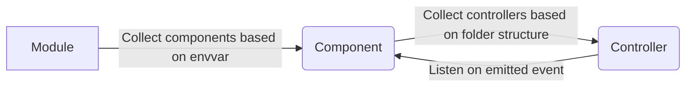
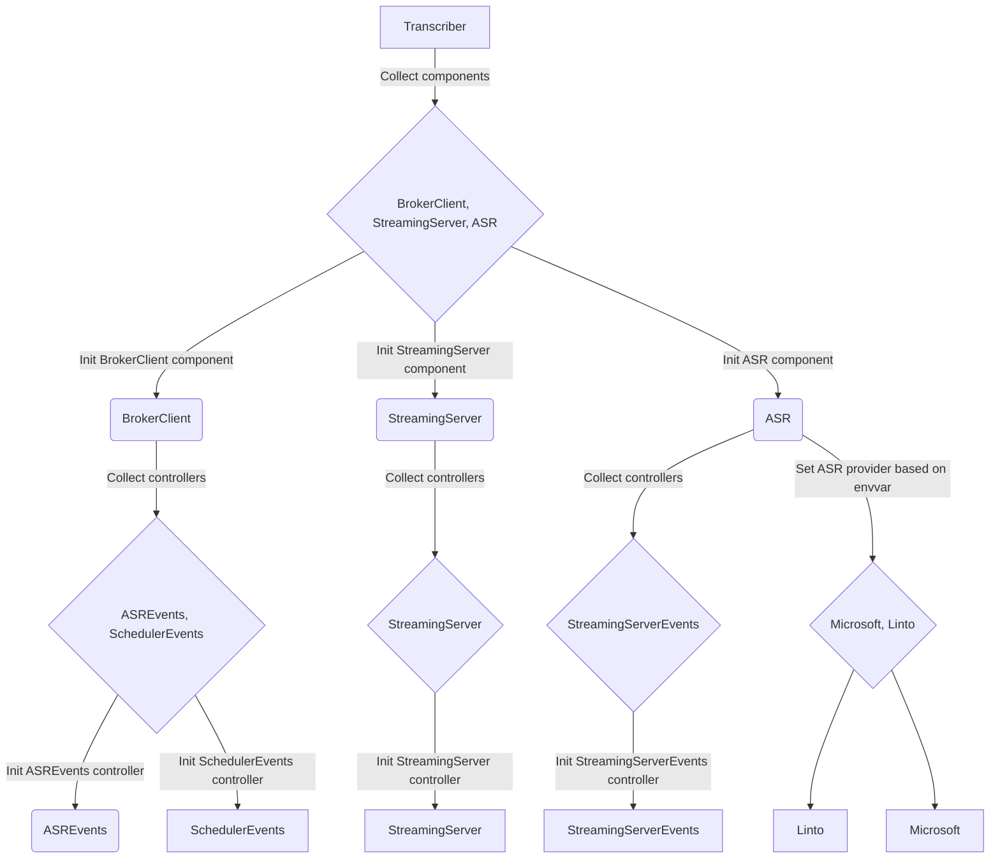

# Modules architecture

The architecture of all modules in this project follows an event-driven style of programming. Initialization follows a specific process. First, the main file is loaded. Then, it reads in an environment variable that contains a list of components separated by a comma. Next, it initializes each of these components and stores them in this.components. These components then load all their controllers, with the loadEventControllers() function browsing the controllers subfolder of the component and loading all the controllers.

The controllers then subscribe to events to react to them. They can subscribe to any component using this.app.components, which matches the this.components of the module. Finally, events are emitted by components and processed by the controllers of these components.

1. The main module is loaded.
2. An environment variable containing a list of components separated by a comma is read in.
3. Each component is initialized and stored in `this.components`.
4. Each component loads all its controllers using the `loadEventControllers()` function, which browses the `controllers` subfolder of the component and loads all the controllers.
5. The controllers subscribe to events to react to them. They can subscribe to any component using `this.app.components`, which matches the `this.components` of the module.
6. Events are emitted by components and processed by the controllers of these components.

### Example for the Transcriber module

The Transcriber module is an example of this initialization process, with a diagram provided to illustrate the process.

In the event-driven programming style used in this project, the `StreamingServerEvents` controller does not depend on ASR. Instead, it calls the generic `start`, `transcribe`, and `stop`. This allows for greater flexibility and modularity, as the `StreamingServerEvents` controller can be used with any ASR component implementation that provides these methods.

### Dependency injection and inversion of control 

Dependency injection is achieved by allowing the main module to read an environment variable that contains a comma-separated list of components to load. This allows the components to be loaded at runtime, rather than being hard-coded into the module. The act like "plugins" This provides flexibility and modularity, as components can be added or removed without affecting the module.

Inversion of control is achieved by using an event-driven programming style. The controllers of each component subscribe to events emitted by other components (or itself), and the components do not need to know which controllers are loaded. This allows for loose coupling between components, as they communicate through events rather than direct method calls. The controllers are responsible for reacting to events and performing the necessary actions, which defers control to the controllers rather than the components. This provides flexibility and modularity, as controllers can be added or removed without affecting the components.

This mechanism provides a flexible and modular architecture that allows for easy extension and modification of the system. By using dependency injection and inversion of control, the system can be easily adapted to changing requirements and new components can be added without affecting the existing components.